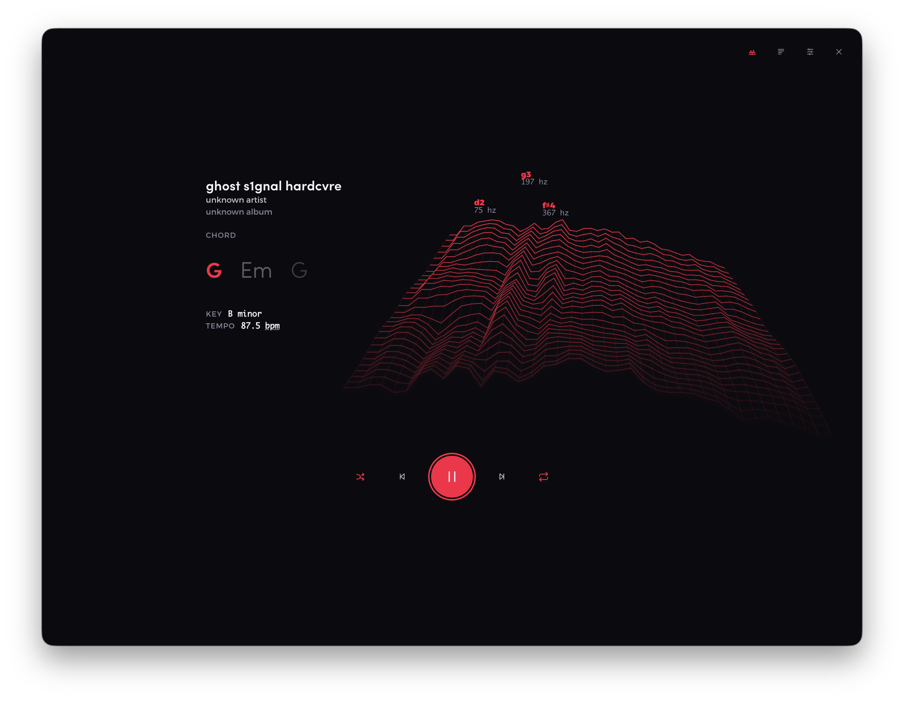
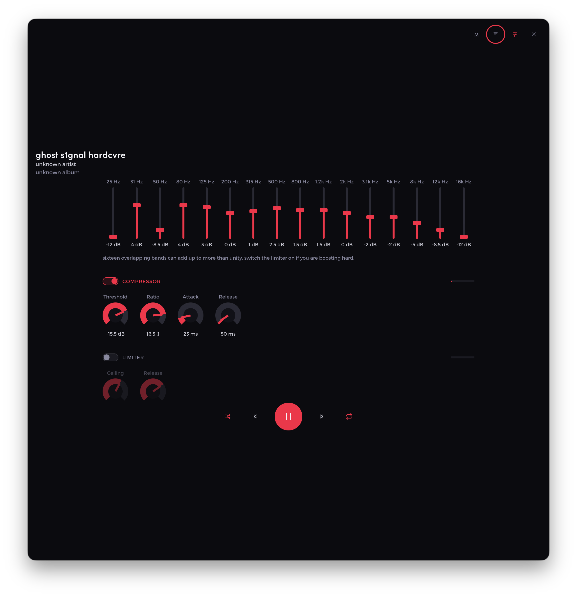
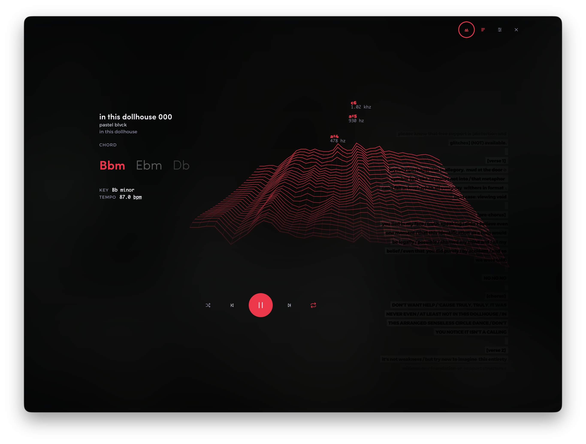
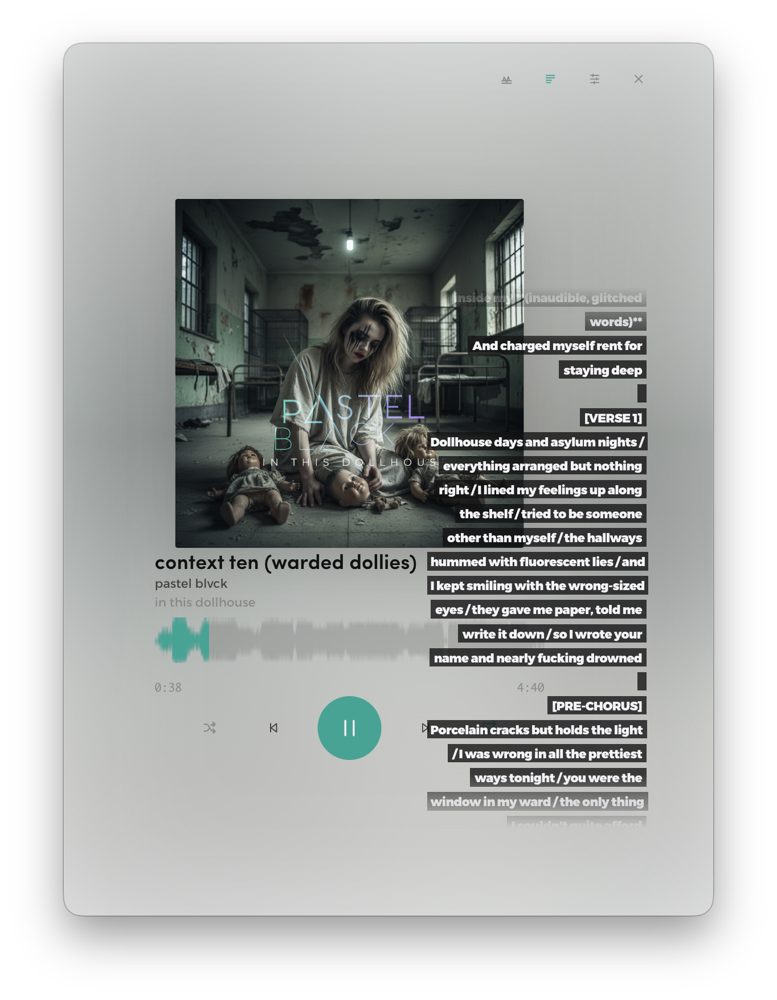
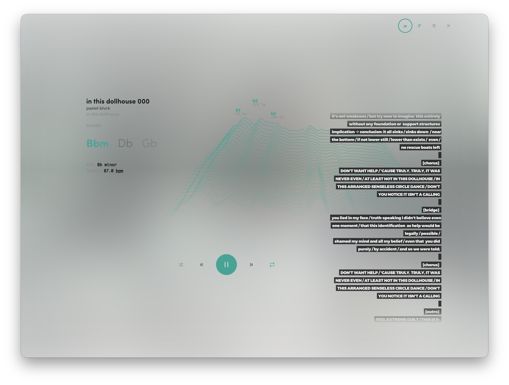
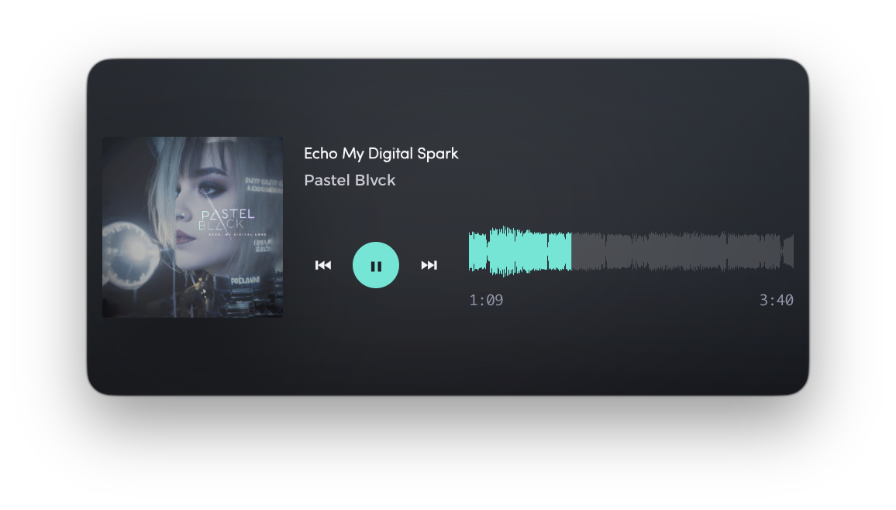
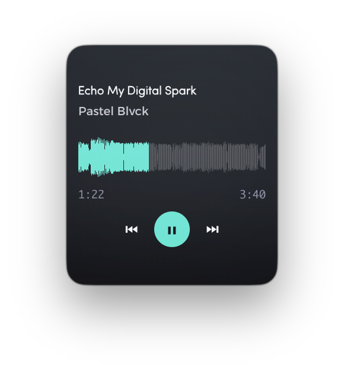
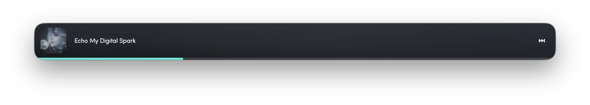
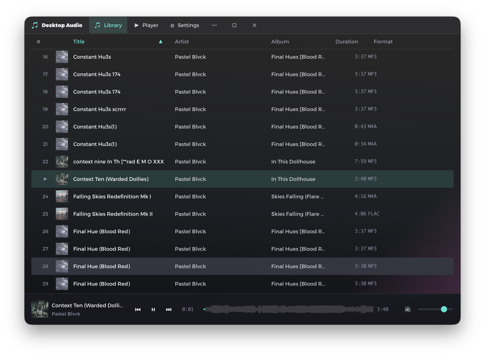
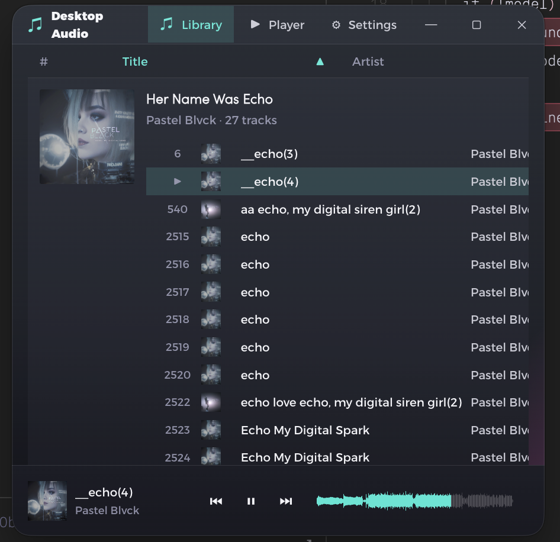

# desktop-audio

Music player for linux and mac. Built with Electron, React and TypeScript.



## Audio processing

A full DSP chain sits between the file and your speakers: a **sixteen-band
equaliser**, a **compressor** and a **limiter**, each switchable on its own.



**The equaliser is one line you draw on, over the sound it is shaping.** The
curve is the filter cascade's real magnitude response — not a spline through
sixteen fader values, which would draw dips the chain never plays, because the
bands overlap on purpose — and the filled shape beneath it is the analyser,
wired **downstream of the chain**. So the spectrum shows what is coming out
rather than what went in, and a band you lift lifts the ground under the bump
you just drew. Both share a logarithmic frequency axis, because on a linear one
thirteen of the sixteen bands would land in the leftmost tenth.

Bypassing a module sets neutral parameters instead of unplugging it: splicing a
node in or out of a running graph shifts the sample stream in time and clicks,
while a flat EQ band and a `1:1` compressor are already transparent.

Everything stays a native control underneath. The curve keeps sixteen real range
inputs behind it for keyboard and screen-reader use, and each knob is a range
input under a drawn face — pointer, wheel and keyboard all work, dragging is
vertical and relative so a full sweep takes real travel rather than 52 pixels,
and holding <kbd>Shift</kbd>, <kbd>⌘</kbd> or <kbd>Ctrl</kbd> drops it to fine
mode. The page needs a wide window and is not offered in a narrow one.

## Chords, key and tempo

Tracks are analysed **in the background, once**, on a worker thread — chord
regions, main key, tempo and a steady beat grid. Results are cached in SQLite
against the track id, the source file's mtime and the analyser version, so the
work happens once per file and a re-scan never repeats it. The cache is its own
table, not a column on `tracks`, so hydrating the library never drags every beat
of every song through the renderer.



What you get on screen:

- the **current chord** with the next two trailing behind it, moving as playback
  crosses each boundary
- the **key and tempo** of the track, read straight off the analysis
- **beat and downbeat markers** drawn into the full now-playing waveform
- a **live FFT wireframe** — this one is real-time, not cached — with the
  dominant partials named by pitch and frequency, on a logarithmic axis, because
  pitch is logarithmic and a linear one buries five octaves in the left tenth

All three static readouts are **off by default** and switch on individually under
**Settings → Preferences**; the analysis only runs for what you have asked to see.

## Lyrics

Lyrics come from the file's own tags and lay over the now-playing view rather
than replacing it — the rest of the screen steps aside to make room. They scroll
along with the track until you scroll them yourself, at which point they are
yours.

| | |
|:--:|:--:|
|  |  |
| **Over the artwork** | **Under a theme derived from the cover** |

## The mini player

Drag the window smaller and the player rebuilds itself around whatever room is
left. Album art goes first, then the buttons — the title and the progress line
are the last things standing. At its smallest it's a strip of chrome that still
plays your music.

| | | |
|:--:|:--:|:--:|
|  |  |  |
| **Landscape** — art, controls & waveform | **Portrait** — the full stack, narrowed | **Compact** — art sheds, controls stack |



*Slim bar — the progress bar flattens into a hairline pinned to the window edge.*

## Library

Breadcrumbs across the top navigate the folder tree, and every nested folder is
a native disclosure that can be toggled at any depth. The header collapses as
you scroll so the column header can pin to the top of the view.




Tracks group by album, artist or path, in three row densities. Alt-clicking one
group applies its next state to every group. Right-clicking the table header
opens the column picker exactly at the pointer; every field, including year and
rating, can be shown or hidden.



## Keyboard control

Playback, views, settings, and the side menu have global shortcuts. Bindings can
be reassigned instantly under **Settings → Hotkeys**. See
[key bindings](docs/keybindings.md) for the defaults and package API.

## Native, instant UI

The app keeps one stable, shallow, virtualized library and player tree. Natural
block and grid flow handle layout; flex is kept for the few controls that are
genuinely one-dimensional. Dialogs, popovers, disclosures, forms, and action
menus use native HTML behavior. The waveform is an SVG backed by a native range
input, so pointer, touch, and keyboard seeking work without per-frame DOM
animation. It begins as a line and expands once real samples arrive. Interaction
transitions are intentionally zero-duration; loading and ambient artwork
feedback remain non-blocking.

## Development

```bash
bun install
bun run start        # dev (electron-forge start)
bun run typecheck    # tsc --noEmit
bun run lint         # eslint ./src
bun test             # vitest run
bun run make         # production build
```

Screenshots live in [`assets/screenshots/`](assets/screenshots). The landing page
copies them into its own artifact at build time —
`node scripts/build-screenshots-manifest.mjs` refreshes both the copies and the
gallery manifest, and a new capture dropped into that folder is published by the
next deploy.

See [CLAUDE.md](CLAUDE.md) for architecture notes and
[docs/music-analysis.md](docs/music-analysis.md) for the analysis pipeline.

## macOS release signing

Local macOS packages and CI builds without Apple credentials receive a valid
ad-hoc signature. That is useful for development, but downloaded artifacts will
not pass Gatekeeper automatically.

For trusted public artifacts, configure these GitHub Actions repository secrets:

- `MACOS_CERTIFICATE`: a base64-encoded Developer ID Application `.p12`
- `MACOS_CERTIFICATE_PASSWORD`: the `.p12` export password
- `APPLE_ID`: the Apple developer account email
- `APPLE_APP_SPECIFIC_PASSWORD`: an app-specific password for notarization
- `APPLE_TEAM_ID`: the ten-character Apple developer team ID

The release workflow imports the certificate into a temporary keychain, signs
the app, submits it to Apple for notarization, staples the ticket, and verifies
both the signature and Gatekeeper assessment before uploading the artifact.
