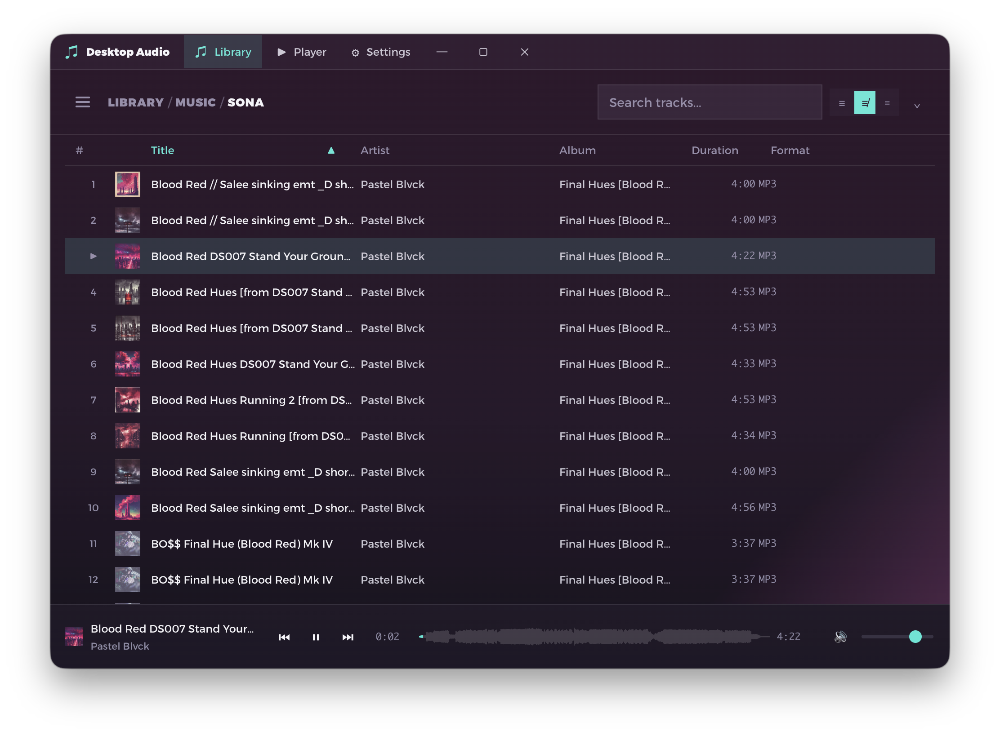
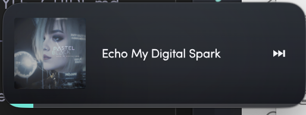

# desktop-audio

Music player for linux and mac. Built with Electron, React and TypeScript.



## The mini player

Drag the window smaller and the player rebuilds itself around whatever room is
left. Album art goes first, then the buttons — the title and the progress line
are the last things standing. At its smallest it's a strip of chrome that still
plays your music.

| | |
|:--:|:--:|
|  |  |
| **Landscape** — art, controls & waveform | **Portrait** — the full stack, narrowed |
|  |  |
| **Compact** — art sheds, controls stack | **Smallest** — art, title, next |


*Slim bar — the progress bar flattens into a hairline pinned to the window edge.*

## Library

Breadcrumbs across the top navigate the folder tree; the header collapses as
you scroll so the column header can pin to the top of the view.


Tracks group by album, artist or path, in three row densities.


## Development

```bash
bun install
bun run start        # dev (electron-forge start)
bun run typecheck    # tsc --noEmit
bun run lint         # eslint ./src
bun test             # vitest run
bun run make         # production build
```

See [CLAUDE.md](CLAUDE.md) for architecture notes.
